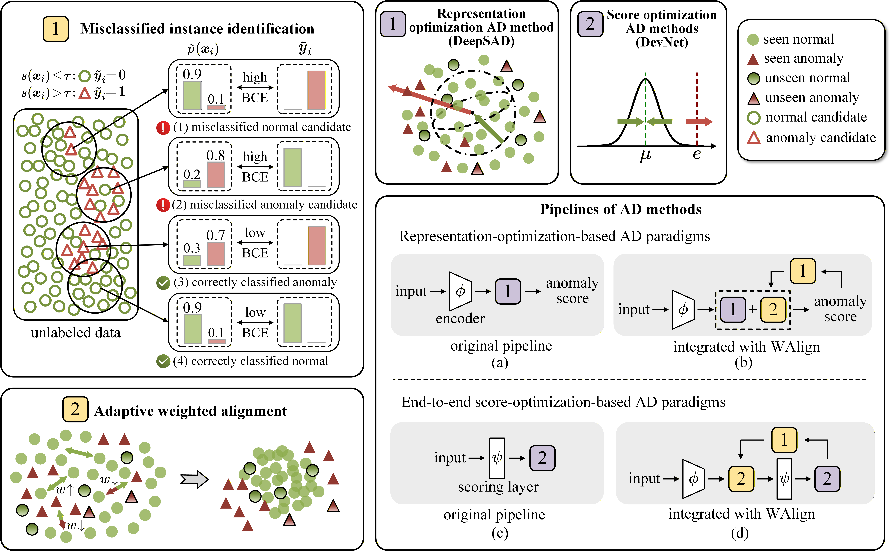

# WAlign
Implementation of ["Normal Invariant Representation Learning via Weight-guided Distribution Alignment for Open-set Anomaly Detection"]. (Accepted by DASFAA 2026)

## Paper abstract
Anomaly detection is a critical component for ensuring data quality in data management; however, as continuously collected data introduces unseen normal and anomalous classes, the performance of traditional methods often deteriorates markedly. While some approaches attempt to mitigate this challenge by simulating unseen anomaly distributions, they are constrained by the quality of the generated pseudo-anomalies and fail to solve the core problem of misidentifying unseen normal instances as anomalous. We address these limitations from a novel perspective of normal invariant representation learning by proposing WAlign, which introduces a misclassification-aware weighting mechanism for the normal distribution alignment process. This mechanism mitigates the detrimental influence of misclassified instances and unlabeled anomalies on representation learning for normal instances. As a plug-and-play module, WAlign can be seamlessly integrated into two well-established anomaly detection paradigms. For each paradigm, we instantiate a lightweight base model and conduct extensive experiments on five real-world datasets. Experimental results demonstrate that integrating WAlign improves the AUC-PR by up to 3.7% and 6.1% over the respective base models, and achieves improvements reaching up to 29.7%, 35.0%, 55.9%, 79.1%, and 87.4% when further compared with 14 state-of-the-art baselines across five real-world datasets, while maintaining competitive time efficiency.

---



## Running environment
Python version 3.8.18

Create suitable conda environment:
```
conda env create -f environment.yml
```

## Dataset Settings

The specific settings for the five datasets used in our experiments are as follows:

### **FMNIST**
The FMNIST dataset contains grayscale images from ten fashion categories.  
- **Seen normal:** *T-shirt*, *Dress*, *Coat*  
- **Unseen normal:** *Shirt*  
- **Seen anomaly:** *Sneaker*, *Sandal*  
- **Unseen anomaly:** *Ankle Boot*, *Trouser*

---

### **MNIST-C**
MNIST-C is a handwritten digit dataset with various perturbations.  
- **Seen normal:** Digit 0 under *no perturbation*, *brightness perturbation*, and *shot-noise perturbation*  
- **Unseen normal:** Digit 0 under *fog perturbation*  
- **Seen anomaly:** Digit 1 under *no perturbation* and *brightness perturbation*  
- **Unseen anomaly:** Digit 1 under *shot-noise perturbation* and digit 7 under *no perturbation*

---

### **Yelp**
Yelp is a textual dataset comprising business reviews with ratings ranging from 1-star to 5-star.  
- **Normal:** 4-star and 5-star reviews  
- **Seen anomaly:** 1-star reviews  
- **Unseen anomaly:** 2-star reviews

---

### **NSL-KDD**
NSL-KDD is a tabular dataset used for network intrusion detection.  
- **Seen anomaly:** *DoS*, *R2L*  
- **Unseen anomaly:** Remaining anomaly classes

---

### **NB15**
NB15 is another network intrusion detection dataset that includes seven anomalous categories.  
- **Seen anomaly:** *Backdoor*, *DoS*, *Generic*  
- **Unseen anomaly:** Remaining anomaly classes

---

## 🔗 Original Dataset Links

| Dataset | Link |
|:--------:|:-----|
| **FMNIST** | [https://github.com/zalandoresearch/fashion-mnist](https://github.com/zalandoresearch/fashion-mnist) |
| **MNIST-C** | [https://github.com/google-research/mnist-c](https://github.com/google-research/mnist-c) |
| **Yelp** | [https://huggingface.co/datasets/Yelp/yelp_review_full](https://huggingface.co/datasets/Yelp/yelp_review_full) |
| **NB15** | [https://research.unsw.edu.au/projects/unsw-nb15-dataset](https://research.unsw.edu.au/projects/unsw-nb15-dataset) |
| **NSL-KDD** | [https://www.unb.ca/cic/datasets/nsl.html](https://www.unb.ca/cic/datasets/nsl.html) |

## Citation
>Lu G., Zhou F., Shou H., Pavlovski M., Dong C., Liao B., Jin C., “Normal Invariant Representation Learning via Weight-guided Distribution Alignment for Open-set Anomaly Detection”, DASFAA, 2026.
